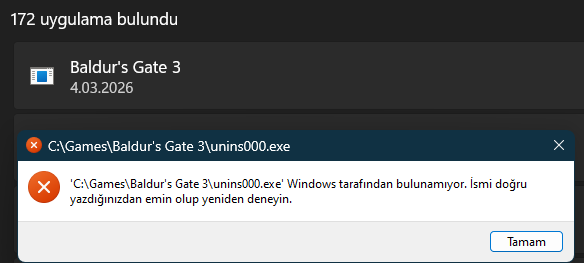
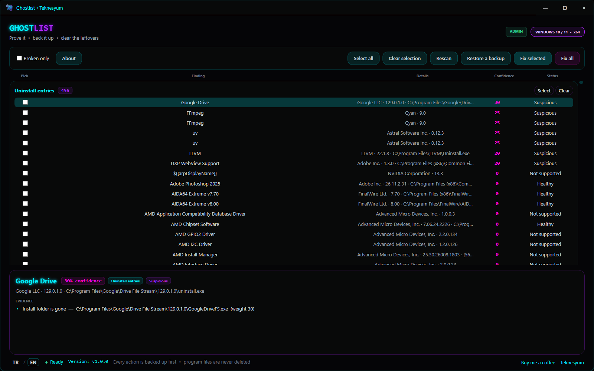

# Ghostlist

<p align="center">
  
</p>

**Ghostlist finds what Windows leaves behind after an uninstall, proves it is dead, and removes it with a backup you can undo.**

An uninstall rarely takes everything with it. The Installed apps list keeps showing a program whose uninstaller is gone. Start menu shortcuts point at executables that no longer exist. Run keys still launch a deleted binary at every boot. Scheduled tasks fire at nothing. Ghostlist scans those places, shows the evidence behind every finding and a confidence score, and only then offers to fix it.



The interface ships in Turkish by default. The `TR / EN` switch at the bottom-left changes the language instantly, with no restart, and remembers the choice.



## What it scans

| Category | What Ghostlist looks at |
| --- | --- |
| Uninstall entries | Per-user and machine-wide uninstall registrations in both the 32-bit and 64-bit Registry views, including MSI product registrations |
| Shortcuts | `.lnk` files in the Start menu and on the desktop, for both the current user and all users |
| Startup entries | `Run` and `RunOnce` values under HKCU and HKLM, plus the Startup folders |
| Scheduled tasks | Task XML under `%WINDIR%\System32\Tasks`, excluding the Microsoft branch |
| Leftover folders | First-level folders under `Program Files`, `Program Files (x86)` and `%LOCALAPPDATA%\Programs` that no installed program claims |
| MSIX packages | Registered packages whose install folder or manifest is gone |

## Safety model

Ghostlist is built to be boring about destruction. The full reasoning lives in [`docs/GUVENLIK.md`](docs/GUVENLIK.md) (Turkish).

- **Every finding carries its evidence.** A finding is a list of observations, each with a weight — "uninstaller file is gone", "install folder is gone". The confidence score is the sum of those weights; the detail panel shows every one of them before you fix anything.
- **Unreadable is not missing.** When a path or Registry branch cannot be read, the evidence is recorded as inconclusive and caps the score, so a finding can never be called broken on the strength of something Ghostlist could not check.
- **Bulk fixing needs a high bar.** "Fix all" only takes findings at 90 confidence or above with at least two independent pieces of evidence, and only in the uninstall, shortcut, startup and task categories. Leftover folders and MSIX packages never take part in it.
- **Nothing is deleted without a backup.** Registry trees, Registry values, task XML and files are all captured first. A file or folder "deletion" is a move into the backup directory, and it is reversible.
- **Uninstall commands are resolved, never executed.** Ghostlist parses the command to decide whether its target still exists. It does not run it.
- **MSIX packages are never removed.** Ghostlist shows you the `Remove-AppxPackage` command and leaves the decision to you.
- **User data is out of scope.** Documents, saved games, `%APPDATA%` and `%LOCALAPPDATA%` data folders are never scanned or touched.
- **A system restore point is requested** before any bulk fix. If System Restore is off or Windows throttles it, the fix continues without one rather than failing.

Backups live under:

```text
%LOCALAPPDATA%\Ghostlist\Backups
```

## Install with one PowerShell command

```powershell
irm https://raw.githubusercontent.com/Teknesyum/Ghostlist/main/scripts/install.ps1 | iex
```

The installer downloads the latest Windows x64 release, installs Ghostlist to `%LOCALAPPDATA%\Programs\Ghostlist`, creates a **Ghostlist** desktop shortcut, and opens the application. Administrator rights are not needed to install. Findings under `HKLM` show as locked in a normal session; the app has a **Restart as administrator** button in the top bar when you need them.

## Command line

The release archive also contains `cli\ghostlist.exe`, a console front end over the same engine as the desktop app. Its output is English.

```powershell
ghostlist scan [--category <name>] [--json] [--min-confidence <n>]
ghostlist fix --id <finding-id> [--dry-run] [--json]
ghostlist fix --all [--min-confidence 90] [--dry-run] [--yes] [--json]
ghostlist restore --list [--json]
ghostlist restore --backup <path>
```

Categories are `uninstall`, `shortcut`, `startup`, `task`, `folder` and `msix`. Exit codes are `0` clean, `1` findings remain, `2` error. `--json` prints one JSON object per line, so results pipe straight into other tools. `--dry-run` changes nothing and says what it would have done. `fix --all` asks for confirmation, and refuses to run at all when input is not a terminal unless you pass `--yes`.

```powershell
ghostlist scan --category shortcut --min-confidence 90 --json
ghostlist fix --all --dry-run
```

## Requirements

- Windows 10 or Windows 11, x64.
- PowerShell 5.1 or newer for installation.

Ghostlist is distributed as a self-contained application and does not require a separate .NET installation.

## Uninstall Ghostlist

```powershell
& "$env:LOCALAPPDATA\Programs\Ghostlist\uninstall.ps1"
```

Removing Ghostlist does not delete the backups under `%LOCALAPPDATA%\Ghostlist\Backups`.

## Build from source

Requirements: Windows x64 and the .NET 8 SDK.

```powershell
git clone https://github.com/Teknesyum/Ghostlist.git
cd Ghostlist
dotnet test Ghostlist.sln -c Release
dotnet publish Ghostlist.App -c Release -r win-x64 --self-contained true -p:PublishSingleFile=true
dotnet publish Ghostlist.Cli -c Release -r win-x64 --self-contained true -p:PublishSingleFile=true
```

## Release

Current version: **v2.0.0** (formerly ProgramFixer)

Version 2 renames the project, widens it from uninstall entries alone to six categories, replaces the old pass/fail check with evidence-based scoring, and changes the backup format. Backups taken by version 1 are migrated on first launch.

Download: [Ghostlist for Windows x64](https://github.com/Teknesyum/Ghostlist/releases/latest)

---

## Support

This application is built in spare time and is free.

<a href="https://github.com/sponsors/Teknesyum"></a>

**[github.com/Teknesyum](https://github.com/Teknesyum)** · [MIT](LICENSE)
